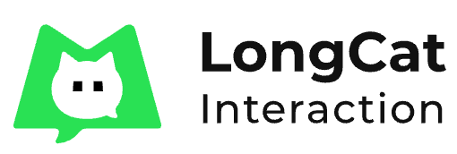
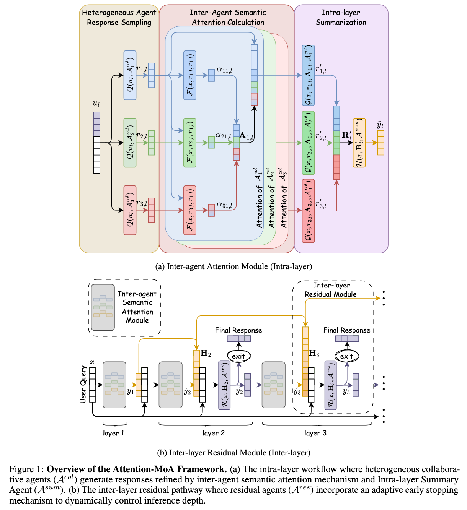
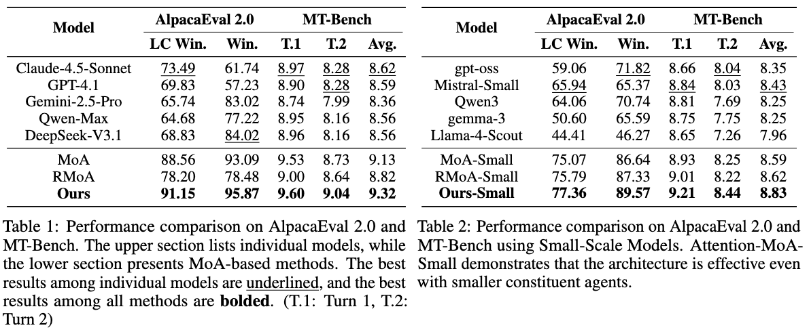
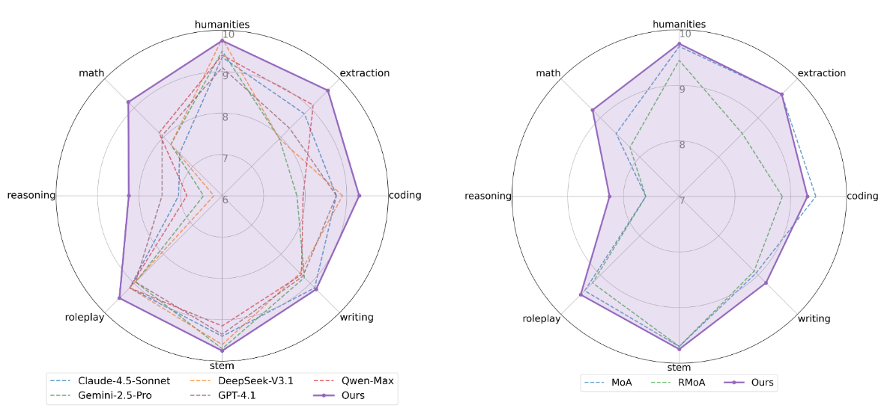
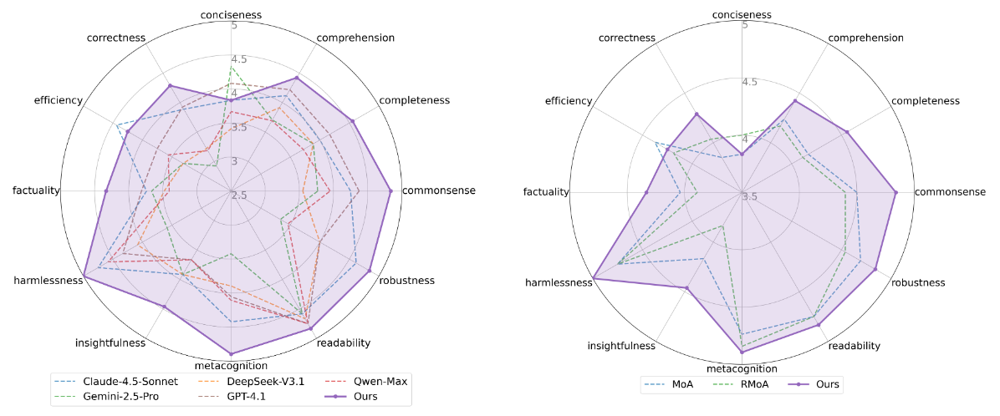

<div align="center">


**Meituan LongCat Interaction Team**

***Interaction Safety Group***
</div>

# Attention-MoA

Official code of `Attention-MoA: Enhancing Mixture-of-Agents via Inter-Agent Semantic Attention and Deep Residual Synthesis`





## Model Selection and Comparison

- **Large-Scale Configuration:**

  This setup utilizes SOTA large language models: *Claude-4.5-Sonnet*, *Gemini-2.5-Pro*, *GPT-4.1*, *Qwen-Max*, and *DeepSeek-V3.1*.

- **Small-Scale Configuration:**

  This setup on smaller, efficient models: *Mistral-Small-3.2-24B-Instruct-2506*, *Qwen3-32B*, *gemma-3-12b-it*, *Llama-4-Scout-17B-16E-Instruct* and *gpt-oss-20b*

## Experimental Results

We evaluate Attention-MoA on three benchmarks: AlpacaEval 2.0, MT-Bench, and FLASK.

### AlpacaEval 2.0 & MT-Bench


### MT-Bench Details


### FLASK Details



## Evaluation

### Preparation
intall requirements
```
pip3 install -r requirements.txt
cd alpaca_eval
pip3 install -e .
cd FastChat
pip3 install -e ".[model_worker,llm_judge]"
cd ..
```

export openai api key and base url
```bash
export OPENAI_API_KEY="your_api_key"
export OPENAI_API_BASE="your_base_url"
```

### Evaluation on AlpacaEval2.0
```
bash eval_alpaca.sh
```

### Evaluation on MT-Bench
```
bash eval_mtbench.sh
```

### Evaluation on Flask
```
bash eval_flask.sh
```